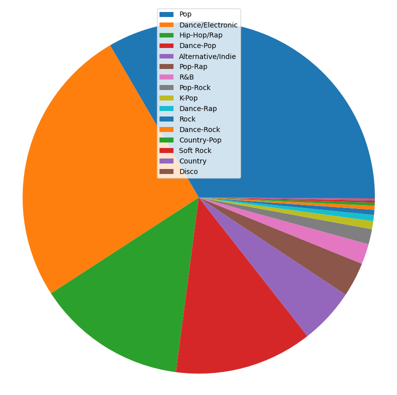
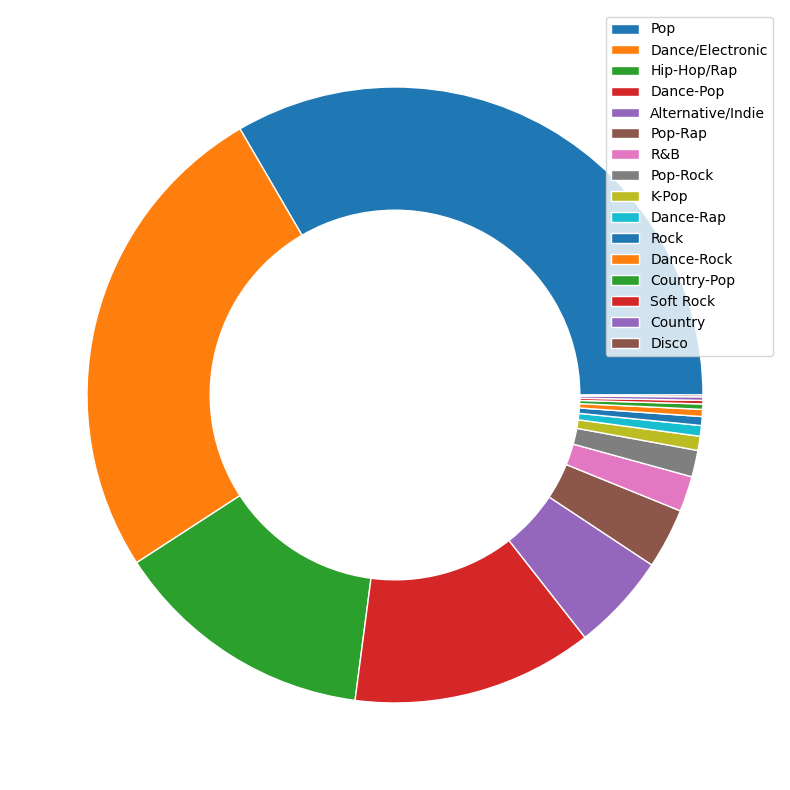
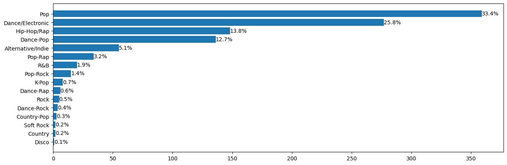

# Music-Genre-Visualization

## Pie Chart

## Donut Chart

## Bar Chart

## Stacked Bar Chart

## Resources
https://stackoverflow.com/questions/30228069/how-to-display-the-value-of-the-bar-on-each-bar-with-pyplot-barh  
http://colorbrewer2.org/#type=qualitative&scheme=Paired&n=11
